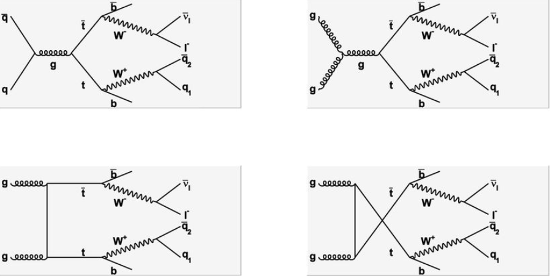

# Measurement of the $|V_{cb}|$ CKM element from diTop-decays at CMS

  

:pencil2: [Topics](docs/Topics.md)

:book: [Sources & Notes](docs/Sources.md)

---

- [OneDrive](https://unipiit-my.sharepoint.com/personal/p_viscone_studenti_unipi_it/_layouts/15/onedrive.aspx?id=%2Fpersonal%2Fp%5Fviscone%5Fstudenti%5Funipi%5Fit%2FDocuments%2FTesi)

- [Cernbox](https://cernbox.cern.ch/files/spaces/eos/user/p/pviscone)

- [GitHub](https://github.com/pviscone/Vcb_ditopDecay)

---

**Achtung!:** don't use the math enviroment in this table. GitHub is stupid and will break all the relative links (but only in the homepage of the repo)

| Name⠀⠀                                                               | Link                                                 | Dataset                                                                                                                                                                                                                                                                                                                                                                                               | Notes ⠀⠀⠀⠀⠀⠀⠀⠀⠀⠀⠀⠀⠀⠀                                                                                                                                                                                                              | state                                             |
| -------------------------------------------------------------------- | ---------------------------------------------------- |:----------------------------------------------------------------------------------------------------------------------------------------------------------------------------------------------------------------------------------------------------------------------------------------------------------------------------------------------------------------------------------------------------- | --------------------------------------------------------------------------------------------------------------------------------------------------------------------------------------------------------------------------------- | ------------------------------------------------- |
| [Reconstruct the  ttbar kinematics](tasks/ttbarKinematics/README.md) | [powheg](tasks/ttbarKinematics/powheg/README.md)     | [/TTToSemiLeptonic\_TuneCP5\_13TeV-powheg-pythia8/RunIISummer20UL17NanoAODv2-106X\_mc2017\_realistic\_v8-v1/NANOAODSIM](https://cmsweb.cern.ch/das/request?input=dataset%3D%2FTTToSemiLeptonic_TuneCP5_13TeV-powheg-pythia8%2FRunIISummer20UL17NanoAODv2-106X_mc2017_realistic_v8-v1%2FNANOAODSIM&instance=prod/global)                                                                               | Recontruct the invariant mass of t, tbar, W separating the adronic and the leptonic decays. Do the same thing for eta and pt. Create an histogram with the different types of hadronic decays of the W (all the possible couples) | done: (dataset not suitable: CKM mixing disabled) |
|                                                                      | [madgraph](tasks/ttbarKinematics/madgraph/README.md) | [/TTJets_SingleLeptFromTbar_TuneCP5_13TeV-madgraphMLM-pythia8/RunIISummer20UL18NanoAODv9-106X_upgrade2018_realistic_v16_L1v1-v1/NANOAODSIM](https://cmsweb.cern.ch/das/request?instance=prod/global&input=file+dataset%3D%2FTTJets_SingleLeptFromTbar_TuneCP5_13TeV-madgraphMLM-pythia8%2FRunIISummer20UL18NanoAODv9-106X_upgrade2018_realistic_v16_L1v1-v1%2FNANOAODSIM)                             | Do the same thing with a MadGraph dataset and add some plots like deltaPhi, deltaEta, deltaR                                                                                                                                      | done                                              |
| [Skim datasets](tasks/CBOnlySemileptonicFilter/README.md)            |                                                      | cbFromT_SingleLeptFromTbar: [/TTJets_SingleLeptFromTbar_TuneCP5_13TeV-madgraphMLM-pythia8/RunIISummer20UL18NanoAODv9-106X_upgrade2018_realistic_v16_L1v1-v1/NANOAODSIM](https://cmsweb.cern.ch/das/request?instance=prod/global&input=file+dataset%3D%2FTTJets_SingleLeptFromTbar_TuneCP5_13TeV-madgraphMLM-pythia8%2FRunIISummer20UL18NanoAODv9-106X_upgrade2018_realistic_v16_L1v1-v1%2FNANOAODSIM) | Isolate the signal (semilept cb) skimming the datasets                                                                                                                                                                            | current                                           |
|                                                                      |                                                      | cbFromTbar_SingleLeptFromT: [/TTJets_SingleLeptFromT_TuneCP5_13TeV-madgraphMLM-pythia8/RunIISummer20UL18NanoAODv9-106X_upgrade2018_realistic_v16_L1v1-v1/NANOAODSIM](https://cmsweb.cern.ch/das/request?input=dataset%3D%2FTTJets_SingleLeptFromT_TuneCP5_13TeV-madgraphMLM-pythia8%2FRunIISummer20UL18NanoAODv9-106X_upgrade2018_realistic_v16_L1v1-v1%2FNANOAODSIM&instance=prod/global)            |                                                                                                                                                                                                                                   |                                                   |

# TODO:

- Add the images to git LFS
- **REMEMBER TO UPDATE IMAGES AND ROOT FILES TO EOS**
